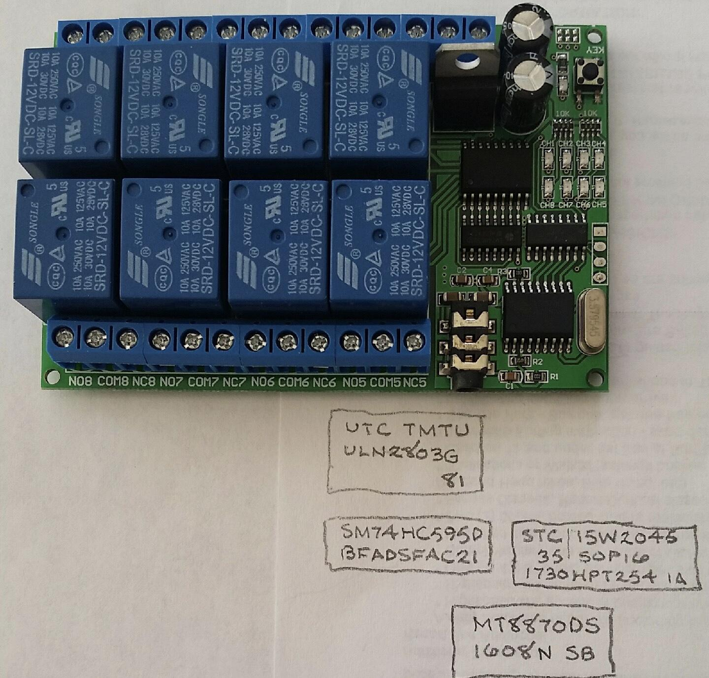

OKI AC125A Parallel-Output DTMF Converter

Using an off-the-shelf [AD22A08](https://www.amazon.com/Hilitand-AD22A08-Signal-Decoder-Controller/dp/B07CSZB976) DTMF Relay Board

# Introduction

The OKI Electric AC125A is an electromechanical Private Branch eXchange (PBX) employing crossbar switching technology.  The AC125A is optimized for the hospitality industry, supporting sixty stations in total; however the traffic handling capacity is limited to a maximum of ten simultaneous calls: consisting of up to two intra-office intercom-type calls and up to 8 central office calls at the same time.

The basic AC125A package supports pulse dialing only; however, OKI provided a plug-in option to add Touch-Tone (DTMF) receivers for both Originating Registers (ORs.)  As the original DTMF converters are not available currently, I set out to make a suitable replacement using modern components.  The rest of this guide provides the details required to build the converters and install them in an OKI AC125A PBX.  This design can likely be adapted to work with other electromechanical telephone switching equipment.  

## Related videos:

Brief [demonstration of the OKI Electric AC125A Crossbar Switch](https://www.youtube.com/watch?v=zIg5bV8V8tk).

The [OKI Parallel-Output DTMF Converter in action](https://www.youtube.com/watch?v=k1Qx7L2s7Ic).

More [detail of the OKI AC125A Crossbar PBX](https://www.youtube.com/watch?v=hjRTW2XuNjI).  Lots of mistakes in this video, but there are some good close-ups of the switch.

# Reverse Engineering the AD22A08

Documentation and resources courtesy of K7TGU:

[DTMF decoder to 8-channel relay board](http://www.k7tgu.com/AD22A08%20DC%2012V%208%20Channel%20DTMF%20MT8870%20Decoder%20Relay%20Board%20Manuals.htm)

MCU is STC15W204S ([Datasheet in English](http://www.stcmcu.com/datasheet/stc/STC-AD-PDF/STC15-English.pdf))

<table>
  <tr>
    <td>Part#</td>
    <td>Flash</td>
    <td>SRAM</td>
    <td>I/O</td>
    <td>EEPROM</td>
  </tr>
  <tr>
    <td>STC15W204S</td>
    <td>4K</td>
    <td>256</td>
    <td>14</td>
    <td>1K</td>
  </tr>
</table>

STC Firmware Programmer: [http://www.stcmicro.com/rjxz.html](http://www.stcmicro.com/rjxz.html)

Other components on the PCB:

SN74HC595D - 8-Bit Shift Registers With 3-State Output Registers ([Datasheet](http://www.ti.com/lit/ds/symlink/sn74hc595.pdf))

ULN2803G - Darlington Transistor Array ([Datasheet](http://www.ti.com/lit/ds/symlink/uln2803a.pdf))

MT8870D - DTMF Decoder ([Datasheet](https://www.microsemi.com/document-portal/doc_view/127041-mt8870d-datasheet-oct2006))

# AD22A08 PCB Notes

<table>
  <tr>
    <td>
Signal</td>
    <td>STC15W204S Pin</td>
    <td>MT8870D
Pin</td>
    <td>SN74HC595D Pin</td>
    <td>ULN2803G
Pin</td>
    <td>1x4 UART Header (Unpopulated)</td>
  </tr>
  <tr>
    <td></td>
    <td>16 (P1.1)</td>
    <td></td>
    <td></td>
    <td></td>
    <td></td>
  </tr>
  <tr>
    <td>StD</td>
    <td>11 (P3.2)</td>
    <td>11</td>
    <td></td>
    <td></td>
    <td></td>
  </tr>
  <tr>
    <td>Q4</td>
    <td>12 (P3.3)</td>
    <td>12</td>
    <td></td>
    <td></td>
    <td></td>
  </tr>
  <tr>
    <td>Q3</td>
    <td>13 (P3.6)</td>
    <td>13</td>
    <td></td>
    <td></td>
    <td></td>
  </tr>
  <tr>
    <td>Q2</td>
    <td>14 (P3.7)</td>
    <td>14</td>
    <td></td>
    <td></td>
    <td></td>
  </tr>
  <tr>
    <td>Q1</td>
    <td>15 (P1.0)</td>
    <td>15</td>
    <td></td>
    <td></td>
    <td></td>
  </tr>
  <tr>
    <td>UART TX</td>
    <td>10 (P3.1)</td>
    <td></td>
    <td></td>
    <td></td>
    <td>2 TxD</td>
  </tr>
  <tr>
    <td>UART RX</td>
    <td>9 (P3.0)</td>
    <td></td>
    <td></td>
    <td></td>
    <td>3 RxD</td>
  </tr>
  <tr>
    <td>GND</td>
    <td>8</td>
    <td></td>
    <td></td>
    <td></td>
    <td>4 GND</td>
  </tr>
  <tr>
    <td>SRCLK</td>
    <td>7 (P5.5)</td>
    <td></td>
    <td>11</td>
    <td></td>
    <td></td>
  </tr>
  <tr>
    <td>+5V / SRCLR#</td>
    <td>6</td>
    <td></td>
    <td>10</td>
    <td></td>
    <td>1 +5V</td>
  </tr>
  <tr>
    <td>RCLK</td>
    <td>5 (P5.4)</td>
    <td></td>
    <td>12</td>
    <td></td>
    <td></td>
  </tr>
  <tr>
    <td>OE#</td>
    <td>4 (P1.5)</td>
    <td></td>
    <td>13</td>
    <td></td>
    <td></td>
  </tr>
  <tr>
    <td>SER</td>
    <td>3 (P1.4)</td>
    <td></td>
    <td>14</td>
    <td></td>
    <td></td>
  </tr>
  <tr>
    <td>BUTTON</td>
    <td>2 (P1.3)</td>
    <td></td>
    <td></td>
    <td></td>
    <td></td>
  </tr>
  <tr>
    <td>LED#</td>
    <td>1 (P1.2)</td>
    <td></td>
    <td></td>
    <td></td>
    <td></td>
  </tr>
  <tr>
    <td>QA</td>
    <td></td>
    <td></td>
    <td>15</td>
    <td>1</td>
    <td></td>
  </tr>
  <tr>
    <td>QB</td>
    <td></td>
    <td></td>
    <td>1</td>
    <td>8</td>
    <td></td>
  </tr>
  <tr>
    <td>QC</td>
    <td></td>
    <td></td>
    <td>2</td>
    <td>7</td>
    <td></td>
  </tr>
  <tr>
    <td>QD</td>
    <td></td>
    <td></td>
    <td>3</td>
    <td>6</td>
    <td></td>
  </tr>
  <tr>
    <td>QE</td>
    <td></td>
    <td></td>
    <td>4</td>
    <td>5</td>
    <td></td>
  </tr>
  <tr>
    <td>
Signal</td>
    <td>STC15W204S Pin</td>
    <td>MT8870D
Pin</td>
    <td>SN74HC595D Pin</td>
    <td>ULN2803G
Pin</td>
    <td>1x4 UART Header (Unpopulated)</td>
  </tr>
  <tr>
    <td>QF</td>
    <td></td>
    <td></td>
    <td>5</td>
    <td>4</td>
    <td></td>
  </tr>
  <tr>
    <td>QG</td>
    <td></td>
    <td></td>
    <td>6</td>
    <td>3</td>
    <td></td>
  </tr>
  <tr>
    <td>QH</td>
    <td></td>
    <td></td>
    <td>7</td>
    <td>2</td>
    <td></td>
  </tr>
  <tr>
    <td>RELAY1</td>
    <td></td>
    <td></td>
    <td></td>
    <td>17</td>
    <td></td>
  </tr>
  <tr>
    <td>RELAY2</td>
    <td></td>
    <td></td>
    <td></td>
    <td>18</td>
    <td></td>
  </tr>
  <tr>
    <td>RELAY3</td>
    <td></td>
    <td></td>
    <td></td>
    <td>16</td>
    <td></td>
  </tr>
  <tr>
    <td>RELAY4</td>
    <td></td>
    <td></td>
    <td></td>
    <td>15</td>
    <td></td>
  </tr>
  <tr>
    <td>RELAY5</td>
    <td></td>
    <td></td>
    <td></td>
    <td>14</td>
    <td></td>
  </tr>
  <tr>
    <td>RELAY6</td>
    <td></td>
    <td></td>
    <td></td>
    <td>13</td>
    <td></td>
  </tr>
  <tr>
    <td>RELAY7</td>
    <td></td>
    <td></td>
    <td></td>
    <td>12</td>
    <td></td>
  </tr>
  <tr>
    <td>RELAY8</td>
    <td></td>
    <td></td>
    <td></td>
    <td>11</td>
    <td></td>
  </tr>
  <tr>
    <td>GND</td>
    <td></td>
    <td></td>
    <td></td>
    <td>10</td>
    <td></td>
  </tr>
</table>

# PA-PE Relay Codes for OKI AC125A PBX

<table>
  <tr>
    <td>DTMF Digit</td>
    <td>PA (NO1)</td>
    <td>PB (NO2)</td>
    <td>PC (NO3)</td>
    <td>PD (NO4)</td>
    <td>PE (NO5)</td>
    <td>C (NO6)</td>
  </tr>
  <tr>
    <td>1</td>
    <td>X</td>
    <td>X</td>
    <td></td>
    <td></td>
    <td></td>
    <td>X</td>
  </tr>
  <tr>
    <td>2</td>
    <td></td>
    <td></td>
    <td>X</td>
    <td></td>
    <td></td>
    <td>X</td>
  </tr>
  <tr>
    <td>3</td>
    <td>X</td>
    <td>X</td>
    <td>X</td>
    <td>X</td>
    <td></td>
    <td>X</td>
  </tr>
  <tr>
    <td>4</td>
    <td></td>
    <td></td>
    <td>X</td>
    <td>X</td>
    <td></td>
    <td>X</td>
  </tr>
  <tr>
    <td>5</td>
    <td>X</td>
    <td>X</td>
    <td></td>
    <td>X</td>
    <td></td>
    <td>X</td>
  </tr>
  <tr>
    <td>6</td>
    <td></td>
    <td></td>
    <td></td>
    <td></td>
    <td>X</td>
    <td>X</td>
  </tr>
  <tr>
    <td>7</td>
    <td>X</td>
    <td>X</td>
    <td></td>
    <td></td>
    <td>X</td>
    <td>X</td>
  </tr>
  <tr>
    <td>8</td>
    <td></td>
    <td></td>
    <td>X</td>
    <td></td>
    <td>X</td>
    <td>X</td>
  </tr>
  <tr>
    <td>9</td>
    <td>X</td>
    <td>X</td>
    <td>X</td>
    <td>X</td>
    <td>X</td>
    <td>X</td>
  </tr>
  <tr>
    <td>0</td>
    <td></td>
    <td></td>
    <td>X</td>
    <td>X</td>
    <td>X</td>
    <td>X</td>
  </tr>
</table>

# Source Code

[https://github.com/hharte/stc15_dtmf](https://github.com/hharte/stc15_dtmf)

Install Small Device C Compiler (SDCC) and the "make" utility on your development machine.

$ make

sdcc -o build/ src/dtmf_dec.c --iram-size 256 

cp build/dtmf_dec.ihx dtmf_dec.hex

You now have the binary dtmf_dec.hex file for downloading to the STC15 MCU with STC-ISP.

# Programming the STC15 with STC-ISP (V6.86E)

## Preparation

Install a 4x1 0.1" header in the four pads next to the crystal on the PCB.  First remove any solder covering the holes, install the header and solder.  Note that pin 1 is the hole with the square pad.

Make a programming cable using an [CP2102 USB UART available from Amazon](https://www.amazon.com/ZYAMY-CP2102-Module-Serial-Downloader/dp/B07CWKHTLH).  The DTMF relay board needs more current at 5V than the CP2102 UART can provide.  Use a separate USB A cable to get +5V and ground.  Connect the Tx and Rx pins of the UART to the DTMF relay board, with power being supplied from the separate USB cable.  Don’t attach 12V to the relay board at this point.

## Communicating with the STC15

Programming the STC15 MCU requires running the ISP downloader first, and then applying power to the board.  The board can even be powered through the UART pins, preventing proper power-on reset.  To avoid problems, make a 4-pin socket that contains power, ground, Tx and Rx that can easily be plugged and unplugged from the DTMF relay board’s header.

First, ensure that you can communicate with the STC15 MCU using the "Check MCU" button on the STC-ISP programming software.  After selecting the proper COM port corresponding to the CP2102 UART, change the “Min Baud” to 2400 and the “Max Baud” to 9600, then press the “Check MCU” button.  After pressing the “Check MCU” button, plug the 4-pin socket into the DTMF relay board.  You should see output similar to: 

Checking target MCU ... 

  MCU type: STC15W204S

  F/W version: 7.2.5T

Current H/W Option:

  . Current system clock source is internal IRC oscillator

  . IRC frequency: 6.017MHz

  . Wakeup Timer frequency: 36.650KHz

  . P3.2 and P3.3 need to be low for next download

  . Power-on reset, use the extra power-on delay

  . RESET pin behaves as I/O pin

  . Reset while detect a Low-Voltage

  . Thresh voltage level of the built-in LVD : 2.69 V

  . Inhibit EEPROM operation under Low-Voltage

  . CPU-Core supply level : 2.74 V

  . Hardware do not enable Watch-Dog-Timer

  . Watch-Dog-Timer pre-scalar : 256

  . Watch-Dog-Timer stop count in idle mode

  . Program can modify the Watch-Dog-Timer scalar

  . Do not erase user EEPROM area at next download

  . Do not control 485 at next download

  . Do not check user password next download

  . TXD is independent IO

  . TXD pin as quasi-bidirectional mode after reset

  . P3.3 output HIGH level after reset

  . Testing time: 2017-8-3

  . MCU type: STC15W204S

  F/W version: 7.2.5T

  Complete !(2019-03-29 09:32:49)

## Programming the new code

Unplug the power/serial programming cable from the DTMF relay board to make sure that you will have a proper power-on reset for the MCU.

Note that the STC15, as configured in the DTMF relay board is programmed to operate at 6.017MHz.  Change this to 11.059MHz in the hardware options, and also make sure "P3.2 and P3.3 need to be low for next download" is not checked.

Click the "Open Code File" button and select the dtmf_dec.hex file.

Press the "Download/Program" button, and then plug the 4-pin socket into the DTMF relay board.

You should see output similar to:

Re-handshaking ... Successful		[0.171"]

Current Baudrate: 9600

Erasing MCU flash ...  OK !		[0.391"]

MCU ID : F51401DA82C22C

Programming user code ... OK !		[3.000"]

Programming OPTIONS ... OK !		[0.125"]

H/W Option upgrade to:

  . Current system clock source is internal IRC oscillator

  . IRC frequency: 11.057MHz

  . Do not detect the level of P3.2 and P3.3 next download

  . Power-on reset, use the extra power-on delay

  . RESET pin behaves as I/O pin

  . Reset while detect a Low-Voltage

  . Thresh voltage level of the built-in LVD : 2.69 V

  . Inhibit EEPROM operation under Low-Voltage

  . CPU-Core supply level : 2.74 V

  . Hardware do not enable Watch-Dog-Timer

  . Watch-Dog-Timer pre-scalar : 256

  . Watch-Dog-Timer stop count in idle mode

  . Program can modify the Watch-Dog-Timer scalar

  . Erase user EEPROM area at next download

  . Do not control 485 at next download

  . Do not check user password next download

  . TXD is independent IO

  . TXD pin as quasi-bidirectional mode after reset

  . P3.3 output HIGH level after reset

  . MCU ID : F51401DA82C22C

  . MCU type: STC15W204S

  F/W version: 7.2.5T

  . Set frequency: 11.059MHz

  . Adjusted frequency: 11.057MHz

  . Trim error: -0.022%

  Complete !(2019-03-30 16:07:22)

Now that programming is complete, you can use the UART/programming cable to get serial output from the dtmf_dec program.  The serial port parameters are 9600 baud, n,8,1.

# Wiring to the OKI AC125A DTMF Connector

The OKI AC125A has a 25-pair female AMP connector that provides all the required signals to connect a DTMF converter to both Originating Register 0 and 1.

The A and B leads contain the audio signal for the talking path connected to the OR.  The ST lead is grounded when the OR is in use.  PA-PE leads connect to the corresponding counting relays in the OR.  A ground applied to each lead will operate the corresponding counting relay.  The C lead operates the C relay in the OR when grounded.

Connect the ST lead to the COM terminals of the first six relays on the DTMF relay board.  Connect PA to NO1, PB to NO2, PC to NO3, PD to NO4, PE to NO5, and C to NO6.

The A and B leads go to a phone line audio interface such as the [Radio Shack Phone Recorder Controller](https://www.amazon.com/RadioShack-Recorder-Controller-Single-43-421/dp/B0141NMCFW). The ⅛" audio output from the recorder controller plugs into the ⅛” jack on the DTMF relay board.

## OKI AC125A DTMF Connector Pin Designations

<table>
  <tr>
    <td>Pair</td>
    <td>AMP Pin#</td>
    <td>Designation</td>
    <td>Color Code</td>
    <td>Function</td>
    <td>Function</td>
  </tr>
  <tr>
    <td>1</td>
    <td>26</td>
    <td>A0</td>
    <td>(W-BL)</td>
    <td>DTMF Rec 0</td>
    <td>A</td>
  </tr>
  <tr>
    <td></td>
    <td>1</td>
    <td>B0</td>
    <td>(BL-W)</td>
    <td></td>
    <td>B</td>
  </tr>
  <tr>
    <td>2</td>
    <td>27</td>
    <td>ST0</td>
    <td>(W-O)</td>
    <td></td>
    <td>ST</td>
  </tr>
  <tr>
    <td></td>
    <td>2</td>
    <td></td>
    <td>(O-W)</td>
    <td></td>
    <td></td>
  </tr>
  <tr>
    <td>3</td>
    <td>28</td>
    <td>PA0</td>
    <td>(W-G)</td>
    <td></td>
    <td>PA</td>
  </tr>
  <tr>
    <td></td>
    <td>3</td>
    <td>PB0</td>
    <td>(G-W)</td>
    <td></td>
    <td>PB</td>
  </tr>
  <tr>
    <td>4</td>
    <td>29</td>
    <td>PC0</td>
    <td>(W-BR)</td>
    <td></td>
    <td>PC</td>
  </tr>
  <tr>
    <td></td>
    <td>4</td>
    <td>PD0</td>
    <td>(BR-W)</td>
    <td></td>
    <td>PD</td>
  </tr>
  <tr>
    <td>5</td>
    <td>30</td>
    <td>PE0</td>
    <td>(W-SL)</td>
    <td></td>
    <td>PE</td>
  </tr>
  <tr>
    <td></td>
    <td>5</td>
    <td>C0</td>
    <td>(SL-W)</td>
    <td></td>
    <td>C</td>
  </tr>
  <tr>
    <td>9</td>
    <td>34</td>
    <td>A1</td>
    <td>(R-BR)</td>
    <td>DTMF Rec 1</td>
    <td>A</td>
  </tr>
  <tr>
    <td></td>
    <td>9</td>
    <td>B1</td>
    <td>(BR-R)</td>
    <td></td>
    <td>B</td>
  </tr>
  <tr>
    <td>10</td>
    <td>35</td>
    <td>ST1</td>
    <td>(R-S)</td>
    <td></td>
    <td>ST</td>
  </tr>
  <tr>
    <td></td>
    <td>10</td>
    <td></td>
    <td>(S-R)</td>
    <td></td>
    <td></td>
  </tr>
  <tr>
    <td>11</td>
    <td>36</td>
    <td>PA1</td>
    <td>(BK-BL)</td>
    <td></td>
    <td>PA</td>
  </tr>
  <tr>
    <td></td>
    <td>11</td>
    <td>PB1</td>
    <td>(BL-BK)</td>
    <td></td>
    <td>PB</td>
  </tr>
  <tr>
    <td>12</td>
    <td>37</td>
    <td>PC1</td>
    <td>(BK-OR)</td>
    <td></td>
    <td>PC</td>
  </tr>
  <tr>
    <td></td>
    <td>12</td>
    <td>PD1</td>
    <td>(OR-BK)</td>
    <td></td>
    <td>PD</td>
  </tr>
  <tr>
    <td>13</td>
    <td>38</td>
    <td>PE1</td>
    <td>(BK-G)</td>
    <td></td>
    <td>PE</td>
  </tr>
  <tr>
    <td></td>
    <td>13</td>
    <td>C1</td>
    <td>(G-BK)</td>
    <td></td>
    <td>C</td>
  </tr>
</table>

